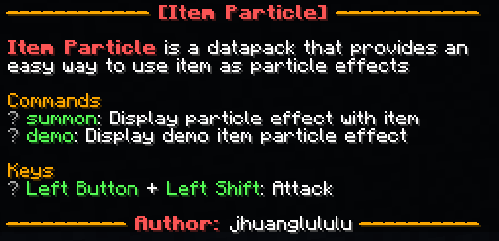

# jhuangmcpylib

**一個 Minecraft 的 Python 套件**
* JSON 文字編輯
* `EasyHelp` 提示介面製作 
* 暫時沒了

**優點**
* 方便儲存和編輯!
* 可以重複使用!
* 帥!

## 備註
目前暫無打算放到Pypi上 所以需要在 github 下載然後放到資料夾裡
只會在有空的時候撰寫 主要撰寫內容也會偏向 Minecraft 地圖製作
如果有任何需要幫助 可以透過 `Discord` 聯繫 `jhuanglululu`

## 成品展示 (EasyHelp)
<h1>
  
</h1>

# 使用教學 (EasyHelp)
NOTE 1: 請具備一定 `Python` 和 [`minecraft json raw text`](https://minecraft.fandom.com/wiki/Raw_JSON_text_format) 知識

NOTE 2: 不會講得很詳細 需要協助可以聯繫我

NOTE 3: 使用 `Python 3.13` 撰寫遇到問題請先確認版本

## 1. 物件類別 `class`

套件中有很多不同的 `class` 可以使用 最常用到的會是 `Text` 和 `TextList`

`Text` 是最基礎的文字方塊 有顏色粗細等參數可以調整
```python
from jhuangmcpylib.jsontext.Text import Text

# 建立一個 Text 物件
mytext = Text("Example Text", bold=True)

# Output: {"text":"Example Text","color":"white","bold":true}
print(mytext)
```

`TextList` 是給 `Text` 專用的陣列
```python
# 建立第二個個 Text 物件
anothertext = Text("Example Text 2", underlined=false)

# 將兩個物件放入 TextList 中
mytextlist = TextList([mytext, anothertext])

# Output: [{"text":"Example Text","color":"white","bold":true},{"text":"Example Text 2", "underlined":false}]
print(mytextlist)
```

在 `TextList` 中加入新的 `Text`
```python
# 加入單個 Text
mytextlist.append(Text("New Text"))

# 加入多個 Text
# NOTE: TextList.extend(List[Text]) 中是輸入 List[Text] 而不是 TextList
mytextlist.extend([Text("Text in List 1"), Text("Text in List 2")])
```

NOTE 4: `Text` 在輸入後存進 `TextList` 的是一個 `copy` 而不是原來的物件 所以存入後無法透過修改外面的 `Text` 物件來修改 `TextList` 裡的物件 (我是想不到會需要修改的原因就是了

# TO BE CONTINUE
